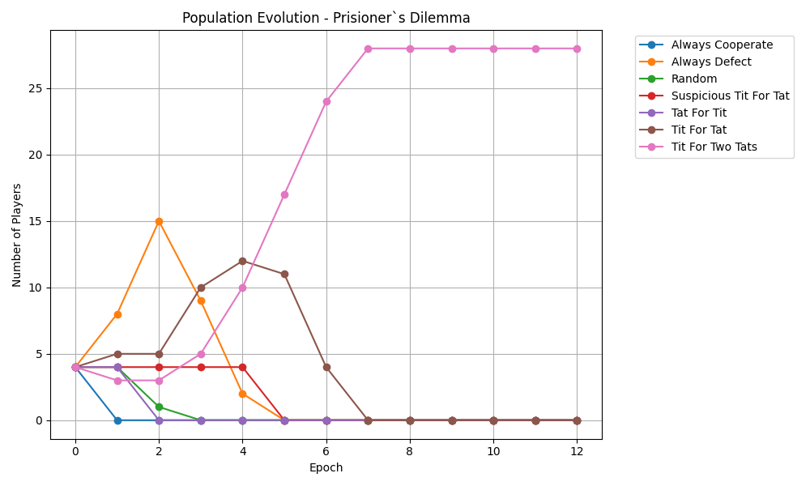
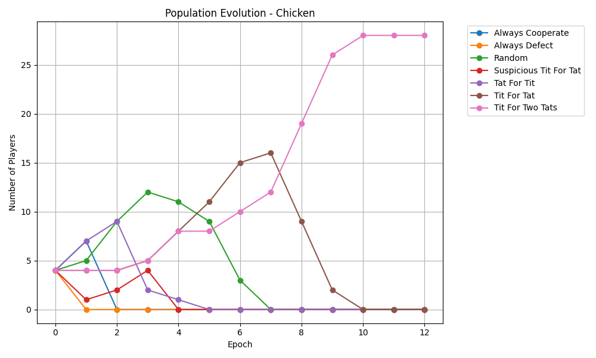
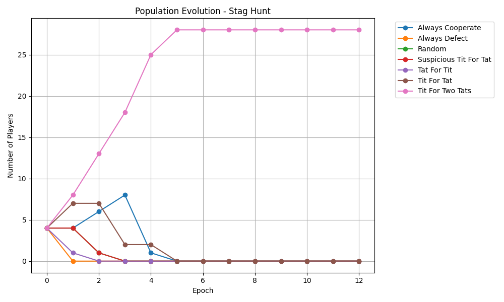
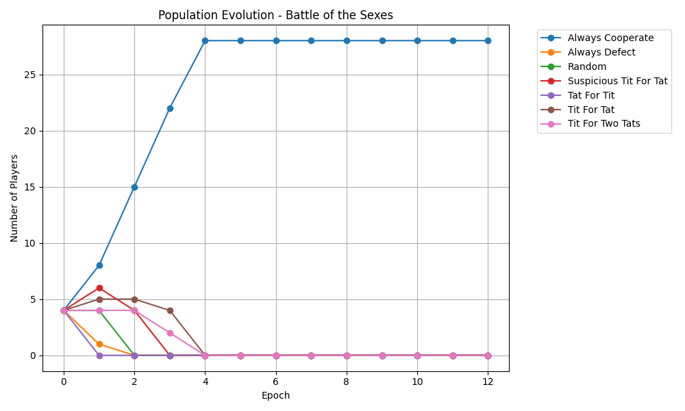

# Game Theory Simulation

This project simulates evolutionary game theory by pitting various decision-making strategies against one another in classic game theoretical environments. Players in a graph engage in repeated matches for a set amount of epochs. At the end of every epoch, the bottom performers "die off" and upper performers "reproduce." Over several epochs, we observe which strategies dominate the population based on survival of the fittest.

Below are the details for each game modeled in this simulation.

---

## 1. Prisoner's Dilemma
**The Idea / Analogy:** Two suspects are arrested, but police don't have enough evidence for a major conviction. They offer each suspect a deal: betray your partner (Defect) or stay silent (Cooperate). The dilemma is that mutual cooperation yields a better collective outcome, but individual temptation makes defecting strictly better for a single player.

**Prizes (Payoff Matrix):**
*   **Cooperate / Cooperate:** Both get 2 points.
*   **Defect / Cooperate:** Defector gets 3 points, Cooperator gets 0.
*   **Cooperate / Defect:** Cooperator gets 0 points, Defector gets 3.
*   **Defect / Defect:** Both get 1 point.

**Population Evolution:**

---

## 2. Chicken
**The Idea / Analogy:** Two drivers are on a collision course. The one who swerves first (Cooperates) is the "chicken" and loses face. The one who keeps driving straight (Defects) wins. However, if neither swerves (Mutual Defection), they crash, leading to the worst possible outcome for both.

**Prizes (Payoff Matrix):**
*   **Cooperate / Cooperate:** Both get 0 points (tie).
*   **Defect / Cooperate:** Defector gets 1 point, Cooperator gets -1.
*   **Cooperate / Defect:** Cooperator gets -1 points, Defector gets 1.
*   **Defect / Defect:** Both get -2 points (crash).

**Population Evolution:**

---

## 3. Stag Hunt
**The Idea / Analogy:** Two individuals go out on a hunt. They can either cooperate to hunt a large stag, or individually hunt small rabbits. The stag requires cooperation to catch and yields a massive reward. A rabbit can be caught alone but yields a tiny reward. The safest play is the rabbit, but the highest reward requires trusting the other person.

**Prizes (Payoff Matrix):**
*   **Cooperate / Cooperate:** Both get 3 points (Stag).
*   **Defect / Cooperate:** Defector gets 2 points (Rabbit), Cooperator gets 0.
*   **Cooperate / Defect:** Cooperator gets 0 points, Defector gets 2 (Rabbit).
*   **Defect / Defect:** Both get 1 point (Rabbit each).

**Population Evolution:**

---

## 4. Battle of the Sexes
**The Idea / Analogy:** A couple wants to go to an event together but prefer different events (e.g., Opera vs. Boxing). They would rather be together at the event they dislike than apart at the event they like. The game focuses heavily on coordination rather than deception.

**Prizes (Payoff Matrix):**
*   **Cooperate / Cooperate:** Player A gets 2, Player B gets 1 (Event 1).
*   **Defect / Cooperate:** Both get 0 (Miskoordination).
*   **Cooperate / Defect:** Both get 0 (Miskoordination).
*   **Defect / Defect:** Player A gets 1, Player B gets 2 (Event 2).

**Population Evolution:**

